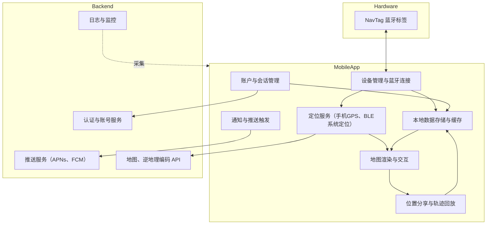

# NavTag智能标签定位管理系统 - 软件著作权申请材料

## 一、引言

## 1.1 设计目的

随着现代生活节奏的加快，个人物品遗失问题日益突出。钥匙、钱包、背包等日常物品的丢失不仅造成经济损失，更带来时间成本和安全隐患。传统的查找方式效率低下，搜索范围有限，且缺乏有效的预防机制。同时，企业在资产管理、设备追踪方面也面临类似挑战，需要高效的定位追踪解决方案。

为解决上述痛点，本软件采用蓝牙连接技术结合移动应用GPS定位的技术方案，开发了一套智能标签定位管理系统。系统通过在物品上附着小型蓝牙标签设备，当标签与用户手机通过蓝牙连接时，标签位置即为手机GPS位置，结合移动应用端的实时追踪、地理围栏预警、轨迹回放等功能，为用户提供全方位的物品防遗失和快速找回服务。

本软件的开发目标是：为个人用户提供简单易用的物品防护工具，帮助快速定位找回遗失物品；为企业用户提供可靠的资产管理平台，实现设备实时追踪和统一管理。通过物联网技术与地理信息系统的深度融合，构建一个高效、智能、用户友好的定位追踪解决方案，降低物品遗失风险，提升用户生活品质和企业管理效率。

---

1.2 术语定义及说明

| 序号 | 术语 / 缩略词 | 说明                                                         |
| ---- | ------------- | ------------------------------------------------------------ |
| 1    | tile          | "瓦片"是计算机图形学和游戏开发中用于分割地图或场景的小块，以提高渲染和管理效率。 |
| 2    | Haversine     | 地理信息系统（GIS）、导航算法等领域，通过半正矢公式计算球体表面两点间的大圆距离。 |


## 二、程序软件的概述

2.1 需求概述


- 产品定位：面向个人防遗失与企业资产追踪的智能标签定位移动应用，通过蓝牙连接手机并利用手机GPS实现标签位置同步。
- 目标用户：
  - 个人用户：钥匙、钱包、背包等随身物品的防遗失与快速找回。
  - 企业用户：固定资产、设备与车辆的定位、轨迹与合规管理。
- 核心使用场景：实时查看标签位置、可信区域围栏提醒、导航前往最后位置、近距响铃查找、历史轨迹回放、批量设备OTA维护。
- 功能性需求：
  - 设备绑定与管理：BLE扫描发现与配对、二维码绑定；设备命名与图标；解绑与误操作防护。
  - 位置同步与展示：标签连接时以手机GPS作为标签当前位置；距离计算与单位切换；点击查看详细地址与时间戳；与第三方导航App联动。
  - 防遗失提醒：可信位置的圆形与多边形地理围栏；提醒间隔（5/10/30分钟）；离开任一可信区域触发本地通知/系统推送。
  - 固件OTA管理：版本检测、预下载、连接校验、电量阈值（<30%阻止）、写入进度与异常处理、更新完成后版本刷新。
  - 账户与安全：邮箱验证码与密码登录；密码找回；UID标识；注销与退出；隐私政策与用户协议可视化。
  - 国际化与辅助：50+语言切换即生效；响铃定位；位置分享；应用版本检查与更新。
- 非功能性需求：
  - 性能：BLE发现与连接稳定性；位置更新与地图渲染的流畅度；低功耗与后台限制适配。
  - 可靠性：断连重试与状态回退；OTA中断恢复；围栏判定准确性与抗抖动。
  - 安全与隐私：本地数据加密存储；位置数据最小化采集与用户可控分享；合规（如GDPR/本地法律）。
  - 兼容性：iOS/Android主要版本与蓝牙协议栈差异适配；不同地区的地图与导航服务兼容。
- 外部依赖与约束：
  - 系统权限：蓝牙、定位、通知等授权；前后台定位策略遵循系统规范。
  - 第三方服务：地图/逆地理编码、导航App调用、推送服务（APNs/FCM）、固件分发服务。
  2.2 软件结构




- 结构说明：
  - “标签位置=手机GPS位置”在BLE连接建立后由定位服务与设备管理协同完成，并通过本地存储与地图UI及时呈现。
  - 围栏判定与提醒由地理围栏模块在本地执行，结合系统通知与推送服务触达用户。
  - OTA流程通过蓝牙通道对接固件分发服务，并进行电量、安全校验与进度反馈。
  - 外部服务用于认证、固件分发、推送与逆地理编码，核心定位与判定逻辑在端侧完成。
## 三、软件主要功能说明

### 2.1 设备绑定与管理

系统支持多种设备绑定方式，满足不同使用场景需求。用户可通过蓝牙自动扫描功能，系统自动识别周边的ATag智能标签设备，实现快速配对；也可使用QR码扫描方式，通过扫描设备二维码完成即时绑定。绑定完成后，用户可为设备自定义名称和图标（提供12种常用图标选择），便于识别和管理。

设备信息管理功能全面，系统实时显示每个标签的MAC地址、当前位置坐标、最后更新时间等关键信息。用户可在设备列表中查看所有已绑定标签的状态，支持多设备同时管理。当设备不再使用时，系统提供安全的解绑功能，通过二次确认机制防止误操作，保障用户数据安全。

### 2.2 实时位置追踪与地图显示

系统基于百度地图，提供高性能的可视化定位服务。地图界面同时显示用户当前位置（蓝色脉冲标记）和所有标签位置（自定义图标标记），直观展现物品分布状况。系统实时计算并显示用户与标签之间的距离，支持米和公里单位自动切换。

地图交互功能丰富，支持多点触控缩放、拖拽平移、一键回中心等操作。用户点击标签标记可查看详细位置信息，包括详细地址、经纬度坐标、最后更新时间等。系统提供多标签快速切换功能，用户可通过前后按钮、滑动手势或底部指示点快速在不同标签间导航。

为提升找回效率，系统深度集成第三方导航应用，支持一键调用Google Maps、高德地图、百度地图等主流导航工具app，快速规划前往标签所在位置的最优路线。

### 2.3 防遗失提醒系统

系统提供基于地理围栏技术的智能防遗失预警功能。用户可通过全局开关控制遗失通知功能的启用状态，并根据个人需求设置提醒间隔（5分钟、10分钟、30分钟三档可选），有效减少误报干扰。

可信位置管理是防遗失功能的核心，系统支持两种围栏模式：

**圆形围栏**：用户在地图上点选中心点，通过滑块调节半径（100-1000米范围可调），系统实时渲染半透明蓝色圆形区域，直观展示安全范围。系统自动通过反向地理编码技术将坐标转换为可读地址，方便用户识别。

**多边形围栏**：适用于不规则区域设置，用户在地图上逐点标记（至少3个点），系统自动闭合形成多边形区域，并实时可视化显示。用户可灵活添加或删除顶点，精确定义安全区域边界。

系统支持添加多个可信位置（如家、公司、常去场所），当标签离开任一可信区域时，按设定间隔发送提醒通知，帮助用户及时发现物品遗失风险。配置数据采用会话级缓存机制，确保设置过程中数据不丢失。

### 2.4 固件OTA更新管理

系统提供完善的固件无线升级（OTA）管理功能。应用自动检测标签设备的固件版本，当有新版本可用时，在相关界面显示红点badge标识，提醒用户进行更新。

固件更新流程设计科学合理：用户可先进行固件预下载，系统显示实时下载进度；下载完成后，系统展示可更新设备列表，采用智能排序策略（可更新设备优先，已更新设备靠后，同等级按名称排序），方便用户批量管理。

更新过程包含多重安全检查机制：系统首先建立与标签设备的蓝牙连接，然后检查设备电量状态（低于30%自动阻止更新，防止更新中断导致设备损坏），通过验证后开始固件写入，并实时显示写入进度。更新完成后，系统自动更新设备版本号，隐藏更新标识。

针对更新过程中可能出现的异常情况，系统提供多场景错误处理机制，包括连接失败提示、电量不足警告、写入中断恢复等，确保用户获得清晰的状态反馈和操作指引。

### 2.5 用户账户与权限管理

系统提供安全可靠的用户账户管理体系。用户注册和登录支持多种认证方式：邮箱验证码登录（一次性密码OTP方式）和传统密码登录，满足不同用户的安全偏好。注册流程要求邮箱验证码确认，确保账户真实有效。

密码找回功能采用邮箱验证码重置机制，用户通过接收OTP验证码完成身份验证，安全重置密码。个人资料管理功能支持用户自定义头像（提供8种内置头像选择）和昵称修改，系统为每个用户分配唯一标识符（UID），支持一键复制，便于技术支持和账户关联。

账户注销功能设计严谨，要求用户输入邮箱验证码进行二次确认，防止误操作导致数据丢失。系统提供安全退出登录功能，清除本地会话信息，保护用户隐私。

### 2.6 多语言国际化支持

为满足全球用户需求，系统提供广泛的多语言支持，涵盖50多种语言，包括简体中文、繁体中文、英语、日语、韩语、法语、德语、意大利语、葡萄牙语等主流语言。用户可通过语言选择界面（单选列表形式）快速切换应用语言，所选语言实时生效，无需重启应用，提升用户体验。

### 2.7 辅助功能

**标签响铃定位**：当标签在附近但难以找到时，用户可通过应用远程触发标签设备发出声音提示，利用听觉辅助快速定位物品。

**位置分享功能**：支持将标签当前位置信息分享给他人，方便协同查找或位置告知场景。

**轨迹查看功能**：系统记录标签的历史位置变化轨迹，用户可按时间轴查看标签移动路径，在地图上绘制轨迹线，了解物品移动历史。系统保存关键位置快照，包含详细地址和时间戳信息，帮助用户回溯物品遗失时间点和可能位置。

**应用版本管理**：系统提供应用版本检查与更新功能，自动提示用户升级到最新版本。

**法律合规**：系统提供用户协议和隐私政策查看入口，保障用户知情权，并且提供账号注销功能，用户可根据需要选择是否注销账户，保护个人隐私。

---

## 三、主要技术特点

### 3.1 蓝牙连接与位置同步技术

系统采用蓝牙连接技术实现标签与手机的通信，标签设备通过蓝牙与用户手机建立连接后，其位置即为手机的GPS位置。这种设计既保证了标签设备的轻量化和低功耗特性，又通过手机GPS实现了全球范围的精准定位。

系统采用智能距离判断算法，基于用户手机当前GPS位置和标签位置的经纬度坐标，自动计算直线距离并智能显示（近距离显示"Around You"，远距离显示具体米数或公里数）。位置同步机制采用实时策略，当标签通过蓝牙与手机连接时，自动更新标签位置为当前手机GPS位置，应用端即时刷新显示，确保用户获取最新位置信息。

### 3.2 智能遗失预防系统

系统实现了先进的地理围栏算法，支持圆形和多边形两种围栏类型。圆形围栏基于圆心加半径的点到圆心距离计算，判断标签位置是否在安全区域内；多边形围栏采用射线法等点在多边形内判定算法，支持复杂不规则区域的精确定义。

可信区域管理采用会话级配置缓存技术，用户在设置围栏过程中，即使页面切换或临时退出，已输入的数据也不会丢失，大幅提升设置体验。分级提醒机制允许用户自定义提醒间隔（5/10/30分钟），在及时预警和避免过度打扰之间取得平衡，有效减少误报率。

系统集成反向地理编码服务，自动将经纬度坐标转换为人类可读的详细地址（街道、门牌号、地标等），提升用户对位置信息的理解和识别效率。

### 3.3 轨迹记录与回放

系统具备完整的历史位置存储功能，持续记录标签位置变化轨迹，形成时间序列数据。用户可通过时间轴查看功能，按时间顺序浏览标签的移动路径，了解物品在特定时间段的位置变化情况。

地图可视化模块在地图上绘制标签移动轨迹线，使用颜色渐变或时间标注区分不同时间段的轨迹，直观展现移动路径。系统自动保存关键位置快照，记录停留时间较长的位置点，包含详细地址、经纬度、时间戳等信息，为用户回溯物品遗失过程提供重要线索。

### 3.4 设备生命周期管理

系统提供全面的固件版本管理功能，自动检测标签设备固件版本，与服务器端版本库对比，及时推送可用更新通知。智能更新策略包含多重保障机制：电量安全检查（设备电量低于30%时阻止更新）、优先级排序（可更新设备优先展示）、场景化错误处理（连接失败自动重试、低电量提示充电、写入中断提供恢复方案）。

OTA无线升级功能通过蓝牙通道实现固件远程更新，无需物理连接或设备返厂，大幅降低维护成本。设备状态监控模块实时显示电量百分比、固件版本号、蓝牙连接状态等关键信息，帮助用户及时了解设备健康状况。

### 3.5 跨平台地图引擎

系统采用Leaflet.js轻量级开源地图库，具备高性能、低资源占用、跨平台兼容的特点。支持OpenStreetMap等多种地图数据源，提供丰富的地图底图选择。

地图交互控件设计人性化，包括缩放控制（+/-按钮和双指捏合手势）、平移操作（拖拽移动）、比例尺显示、一键回中心定位等功能。自定义标记系统支持emoji图标、SVG矢量图形等多种标记类型，可同时显示用户位置、多个标签位置、围栏区域等多层信息，层次清晰，信息密度高。

### 3.6 用户体验优化

系统采用深色赛博风格UI设计，不仅具备现代科技感，更有效减少屏幕电量消耗，提升夜间使用舒适度。玻璃态设计语言运用模糊背景和半透明效果，营造层次分明的视觉体验，提升界面可读性和美感。

触控手势支持全面，包括滑动切换标签、拖拽调整地图视角、双指缩放等常用手势，符合用户操作习惯。实时反馈机制通过Toast通知、进度条、状态指示器等组件，及时向用户反馈操作结果和系统状态，减少等待焦虑，提升交互流畅度。

---

## 四、技术架构说明

### 4.1 技术栈

- **前端框架**：HTML5 + JavaScript（ES6+）
- **UI组件**：自研玻璃态设计系统，基于CSS3变量和模块化组件
- **地图引擎**：Leaflet.js（开源地图库）
- **图标库**：Lucide Icons（轻量级SVG图标集）
- **字体系统**：Orbitron（标题）+ Poppins（正文）

### 4.2 系统架构

系统采用典型的移动应用架构，包含以下核心模块：

- **用户认证层**：负责用户注册、登录、密码管理、会话维护
- **设备管理层**：处理标签绑定、设备列表、信息编辑、状态同步
- **定位服务层**：负责蓝牙设备连接管理和手机GPS定位，标签通过蓝牙连接获取手机GPS位置
- **地图渲染层**：基于Leaflet引擎，处理地图加载、标记绘制、交互响应
- **围栏计算层**：实现地理围栏算法，进行位置判定和预警触发
- **固件管理层**：管理固件版本检测、下载、OTA更新流程
- **数据存储层**：本地缓存用户设置、设备信息、历史轨迹等数据

### 4.3 数据流

```
硬件标签设备 (蓝牙模块)
    ↓
蓝牙连接到用户手机
    ↓
手机GPS获取当前位置 (经纬度 + 时间戳)
    ↓
标签位置同步 (标签位置 = 手机GPS位置)
    ↓
应用前端存储与管理 (本地缓存 + 内存管理)
    ↓
数据处理与计算 (距离计算、围栏判定、轨迹生成)
    ↓
UI渲染与展示 (地图标记、列表更新、通知提醒)
    ↓
用户交互反馈 (操作响应、状态同步)
```

---

## 五、应用场景

### 5.1 个人物品防遗失场景

**日常物品管理**：用户将智能标签附着在钥匙、钱包、背包、雨伞等常用物品上，通过应用实时查看物品位置。出门前检查物品位置，避免遗漏；外出时设置家或公司为可信位置，物品遗留时自动提醒。

**快速找回**：当物品在家中或办公室内难以找到时，使用响铃功能快速定位；物品遗失在外时，通过地图导航前往最后位置，结合轨迹回放分析可能遗失地点。

**出行场景**：旅行或出差时，将标签附着在行李箱、相机包等贵重物品上，通过地理围栏设置酒店或景区为安全区域，物品离开视线时及时发现。

### 5.2 资产管理场景

**企业资产追踪**：企业将标签附着在笔记本电脑、投影仪、测量仪器等固定资产上，实时掌握资产位置和使用状态，防止资产流失。

**设备借用管理**：图书馆、实验室等场所将标签附着在可借用设备上，通过轨迹记录了解设备使用历史，设置地理围栏防止设备被带离指定区域。

**车辆管理**：企业车队或个人车辆安装标签，实时监控车辆位置，记录行驶轨迹，用于车辆调度、路径优化、防盗追踪等场景。

### 5.3 特殊人群关怀场景

**老人与儿童定位**：将标签放置在老人或儿童随身携带的物品中（如书包、水杯），家人可实时了解其位置，设置学校、家等安全区域，离开时自动提醒，提升安全保障。

**宠物追踪**：将标签附着在宠物项圈上，实时掌握宠物位置，设置小区或公园为活动范围，宠物走失时快速定位找回。

---

## 六、创新点总结

1. **双模式地理围栏技术**：创新性地支持圆形和多边形两种围栏类型，满足不同场景的精确定义需求，配合会话级缓存技术，提升设置体验。

2. **智能固件更新策略**：采用电量检查、优先级排序、场景化错误处理等多重机制，确保OTA更新过程安全可靠，降低设备损坏风险。

3. **蓝牙连接与位置同步**：标签设备通过蓝牙与手机连接，利用手机GPS定位实现标签位置同步，既保证设备轻量化又实现全球范围精准定位。

4. **轨迹可视化分析**：基于时间序列的位置数据，提供轨迹回放和关键位置快照功能，为遗失物品找回提供重要线索。

5. **人性化交互设计**：深色玻璃态UI、多语言支持、手势操作、实时反馈等细节优化，全面提升用户体验。

---

**文档版本**: V1.0
**编制日期**: 2025年12月
**适用产品**: NavTag智能标签定位管理系统
